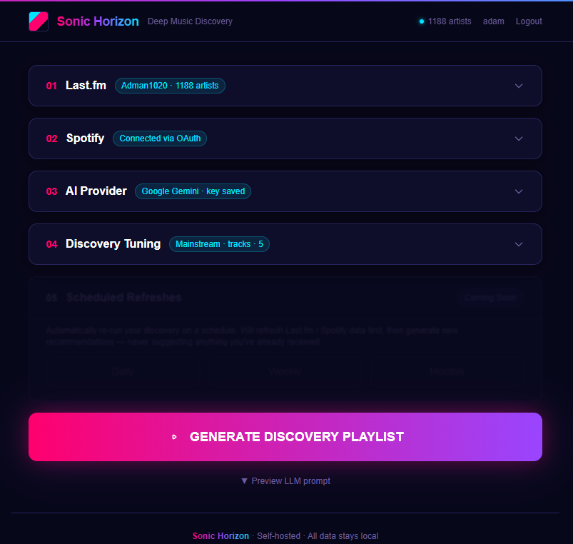

# Sonic Horizon

> ## ⚠️ VIBE-CODED SOFTWARE
>
> This entire project was written by an AI assistant while its human "developer" vibed in the
> background. There are **no tests**, **no type-flagging guarantees**, and the code is best
> described as *"it works on my machine"* — and sometimes not even that.
>
> You should expect the unexpected: sharp edges, undocumented behavior, and the occasional
> existential moment where a feature silently decides not to exist anymore. **Use at your own
> risk, back up your data, and do not run this against anything you cannot afford to lose.**
>
> It is a personal project, not a product. If it breaks, the fix is another AI prompt, not a
> support ticket.

---

## What is this?

**Sonic Horizon** is a self-hosted, single-page web app that generates deep, unbiased, and
highly tailored **music discovery playlists** using Large Language Models.

Instead of relying on Spotify's recency bias or opaque recommendation algorithms, it takes your
**all-time listening history** (Spotify and/or Last.fm), feeds it to an LLM of your choice, and
gets back genuinely off-the-beaten-path recommendations — complete with an explanation for
*why* each track was suggested.

The result is written straight into your Spotify account:

- **`Sonic Horizon`** — the latest generation run (replaced every sync)
- **`Sonic Horizon Archive`** — an append-only, **duplicate-free** history of every recommendation ever made



## Features

- **History-driven discovery** — ingests your all-time Top Tracks, Recently Played, followed artists, and saved library to build a deep profile
- **LLM-generated picks** — every recommendation comes with reasoning and genre tags
- **6 LLM providers** — OpenAI, Anthropic, Google Gemini, OpenRouter, Microsoft Azure AI Foundry, or local Ollama (free-tier friendly)
- **Spotify sync** — creates/updates your current playlist, archives everything into a deduplicated history playlist
- **Last.fm integration** — scrobbled-history matching and supplemental listening data
- **Multi-user + admin panel** — per-user API keys, rate limits, and provider settings
- **Encrypted storage** — your API keys are encrypted at rest in the local database
- **Fully self-hosted** — no phone-home, runs in Docker or directly on Unraid

---

## Running it

### Docker Compose (easiest)

```bash
docker compose up -d --build
```

Open <http://localhost:8080> and complete the one-time **Admin Initialization Setup**
(create your admin account). That's it.

The container mounts two volumes:

| Volume | Purpose |
| ------ | ------- |
| `./config` | SQLite database + encrypted settings (`pde.db`) |
| `./uploads` | Uploaded JSON/CSV listening-data files |

> Set `SPOTIFY_REDIRECT_URI=http://localhost:8080/api/spotify/callback` if you open the app from
> a different host — see [Spotify setup](#spotify) below.

### Unraid

The app publishes a ready-to-use template via the
[unraid-templates](https://github.com/Adman1020/unraid-templates) repo:

- Image: `ghcr.io/adman1020/sonic-horizon:latest`
- WebUI: port **8080**
- App data: `/mnt/user/appdata/sonichorizon` (mapped to `/config`)

Add the template, point it at the image, start the container, and hit the WebUI to do the
first-run admin setup.

### Environment variables

Create a `.env` next to `docker-compose.yml` (a `.env.example` values are shown below). Generate
strong random secrets with `openssl rand -hex 32`.

| Variable | Required | Description |
| -------- | -------- | ----------- |
| `JWT_SECRET` | ✅ | Session signing secret. **Generate one.** |
| `ENCRYPTION_SECRET` | ✅ | Used to encrypt stored API keys. **Generate one.** |
| `SPOTIFY_CLIENT_ID` | Spotify only | OAuth client ID (can also be set per-user in the UI) |
| `SPOTIFY_CLIENT_SECRET` | Spotify only | OAuth client secret (can also be set per-user in the UI) |
| `SPOTIFY_REDIRECT_URI` | Spotify only | Must exactly match what you registered in the Spotify dashboard |
| `LASTFM_API_KEY` | Last.fm only | For Last.fm history matching |
| `DATABASE_URL` | – | Defaults to `file:/config/pde.db` |

## Integrations & what you'll need

The app needs **one LLM provider** to function, and **Spotify** (and optionally **Last.fm**) to
feed it your listening history.

### Spotify

1. Go to the [Spotify Developer Dashboard](https://developer.spotify.com/dashboard) and create an app.
2. Under **Settings**, add your Redirect URI — e.g. `http://localhost:8080/api/spotify/callback`
   (must match what the app uses).
3. Copy the **Client ID** and **Client Secret** into `.env`, **or** paste them into the app's
   Settings page (they're stored encrypted per-user).
4. The app requests these OAuth scopes on connect:

```
user-top-read
user-read-recently-played
user-library-read
user-follow-read
playlist-read-private
playlist-read-collaborative
playlist-modify-public
playlist-modify-private
ugc-image-upload
```

5. In the app, hit **Connect Spotify** and approve the OAuth flow.

### Last.fm (optional)

1. Create an API account at [last.fm/api](https://www.last.fm/api/account/create).
2. Put the key in `.env` as `LASTFM_API_KEY`, and enter your Last.fm username in Settings.

### LLM provider (pick one)

| Provider | Get a key | Free tier notes |
| -------- | --------- | --------------- |
| **Google Gemini** | [AI Studio](https://aistudio.google.com/app/apikey) | Generous free tier — best starting point (outside EU/UK) |
| **OpenRouter** | [Keys](https://openrouter.ai/keys) | Free models available; use `openrouter/free` as the model |
| **OpenAI** | [API keys](https://platform.openai.com/api-keys) | ~$5 new-account credit |
| **Anthropic** | [Console](https://console.anthropic.com/) | Prepaid credits only |
| **Azure AI Foundry** | [Azure portal](https://ai.azure.com/) | Requires a deployed model; key format `endpoint::key` |
| **Ollama** (local) | – | Runs fully offline; URL defaults to `http://host.docker.internal:11434` |

Add the key in the app's Settings page. It is encrypted at rest in your local database.

---

## How the sync works

1. **Read** — every track in `Sonic Horizon` is fetched (paginated).
2. **Archive** — those tracks are appended to `Sonic Horizon Archive`, deduplicated so nothing is
   ever added twice.
3. **Resolve** — the LLM's recommendations are searched on Spotify and deduped.
4. **Replace** — `Sonic Horizon` is overwritten with the new picks (safe-skip if the run
   produced nothing).

Your archive is the durable record; the current playlist is just the latest snapshot.

## Tech stack

- [Next.js](https://nextjs.org) (App Router) + React + TypeScript
- [Prisma](https://www.prisma.io) ORM over SQLite
- JWT sessions (jose), AES-GCM encrypted API-key storage
- Docker / GitHub Actions → GHCR

## Project layout

```
.github/workflows/   CI: build+push to GHCR, Unraid template sync
.unraid/            Unraid template source
app/                Next.js App Router routes + UI
lib/                Spotify, Last.fm, LLM, auth, encryption, Prisma
prisma/             Database schema
public/             Static assets + screenshots
```

---

**TL;DR:** it's vibe-coded, it might break, back up your playlists, and blame the AI — not
yourself.
